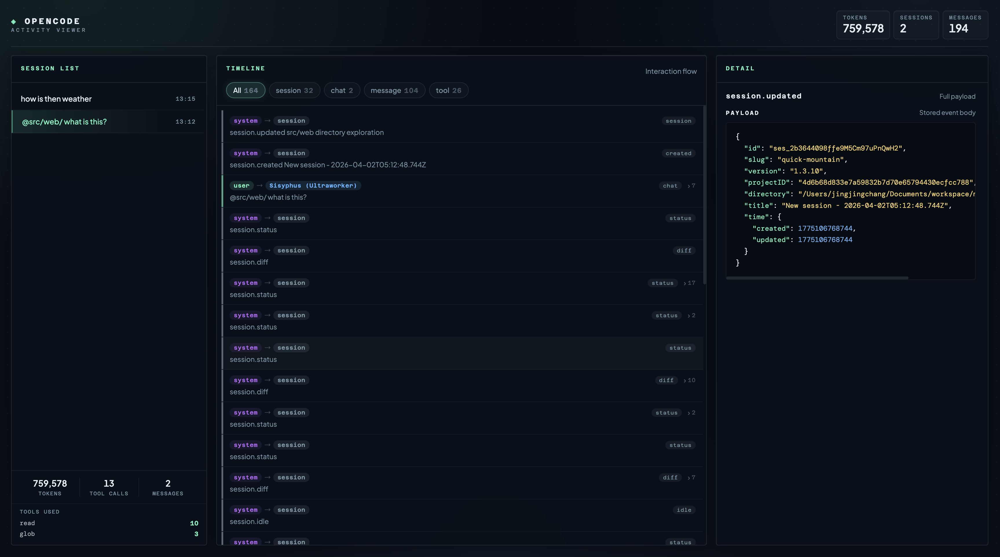

# OpenCode Activity Viewer

View local OpenCode activity in the browser.

<!-- README-I18N:START -->

**English** | [中文](./README.zh.md)

<!-- README-I18N:END -->

## Preview



## Installation and Usage

Loading the npm plugin through `opencode.json` is recommended:

```json
{
  "$schema": "https://opencode.ai/config.json",
  "plugin": ["@wentianen/opencode-viewer"]
}
```

Put the configuration in either of these locations:

- `~/.config/opencode/opencode.json`
- `opencode.json` in the project root

When OpenCode starts, it installs the plugin automatically and caches dependencies under `~/.cache/opencode/node_modules/`.
If you prefer local plugin files, you can also place them in `.opencode/plugins/` or `~/.config/opencode/plugins/`.

Start OpenCode normally. After the plugin initializes, it will automatically detect and try to launch the local Viewer service.

Currently integrated events: `session.*`, `message.updated`, `message.part.updated`, `message.part.removed`, `tool.execute.before`, `tool.execute.after`, `chat.message`.

## Development and Publishing

```bash
npm test
npm run build
```

Before publishing to npm, make sure the tests and build pass, then run:

```bash
npm publish
```
